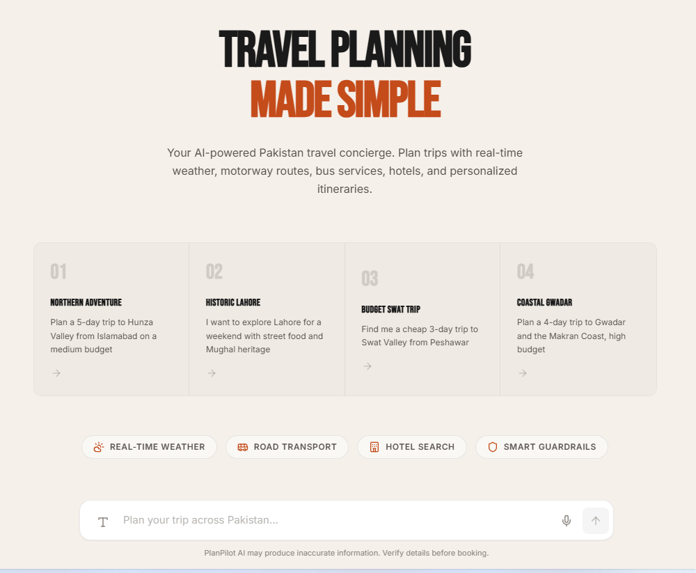

<p align="center">
  
</p>

# PlanPilot

A premium AI-powered Pakistan domestic travel planner that orchestrates specialized agents to build realistic overland trip itineraries with live supporting data.

---

## Overview

AI Travel Planner now focuses strictly on **domestic Pakistan travel**. A Root Agent coordinates four active capabilities -- requirement gathering, weather checks, overland transport planning, hotel discovery, and local itinerary generation -- to deliver an end-to-end plan through a single conversational interface.

The system gathers user requirements through natural conversation, dispatches supporting services in parallel, and synthesizes everything into a polished travel plan with strict guardrails and graceful fallbacks.

---

## Architecture

```
                         +-------------------+
                         |    Next.js UI     |
                         |    (Port 3000)    |
                         +--------+----------+
                                  |
                            REST API / WS
                                  |
                         +--------v----------+
                         |   FastAPI Server  |
                         |    (Port 8000)    |
                         +--------+----------+
                                  |
                         +--------v----------+
                         |    Root Agent     |
                         |  (Orchestrator)   |
                         +---+----+----+----++
                             |    |    |    |
              +--------------+    |    |    +---------------+
              |                   |    |                    |
     +--------v-------+ +--------v----------+ +--v----------------+ +------v---------+
     | Weather Agent   | |Overland Transport| |Hotel Agent         | |Local Expert   |
     | OpenWeatherMap  | |Curated routes +  | |Foursquare + Groq   | |Groq LLM       |
     |                 | |Groq fallback     | |fallback            | |               |
     +----------------+ +-------------------+ +--------------------+ +----------------+
                                  |
                         +--------v----------+
                         |     Supabase      |
                         |   (PostgreSQL)    |
                         +-------------------+
```

---

## Features

**Conversational Planning** -- Natural language interaction with smart follow-up questions. The system identifies missing requirements and asks a maximum of two clarifying questions before making assumptions and proceeding.

**Pakistan Domestic Focus** -- The planner is optimized for cities and tourist regions inside Pakistan only, with localized budget guidance, route context, and cultural recommendations.

**Live Supporting Data** -- Current weather comes from OpenWeatherMap, accommodation discovery uses Foursquare with an LLM fallback, and overland route planning combines curated route data with LLM-generated guidance for uncovered routes.

**Parallel Agent Execution** -- Weather, overland transport, and hotel agents run simultaneously using Python asyncio, reducing total response time to the duration of the slowest single agent call.

**A2A Context Handoff** -- Weather conditions and hotel location are passed directly to the Local Expert agent, ensuring the itinerary accounts for rain (no outdoor tours during storms) and proximity to accommodation.

**Multimodal Output** -- Text mode delivers clean markdown with bold headers, price symbols, and bullet points. Voice mode converts prices to spoken words, strips markdown formatting, and removes URLs.

**Strict Guardrails** -- No hallucinated data (all facts come from APIs), budget adherence warnings when prices exceed expectations, and the "One Voice" principle that hides internal agent architecture from users.

---

## Tech Stack

| Layer | Technology | Purpose |
|-------|-----------|---------|
| Frontend | Next.js 14, React 18, Tailwind CSS | Chat interface with dark premium theme |
| Backend | Python, FastAPI, Uvicorn | Async API server with multi-agent orchestration |
| LLM | Groq (`llama-3.1-8b-instant`) | Conversation handling, requirement extraction, itinerary generation |
| Database | Supabase (PostgreSQL) | Conversation persistence, trip plan storage (JSONB) |
| Weather | OpenWeatherMap API | 5-day forecasts, geocoding, climate estimates |
| Transport | Curated Pakistan route data + Groq fallback | Domestic motorway, bus, and self-drive planning |
| Hotels | Foursquare Places API | Hotel discovery with PKR budget estimation |

---

## Getting Started

### Prerequisites

- Python 3.10+
- Node.js 18+
- API keys for: Groq, OpenWeatherMap, Supabase, Foursquare

### 1. Clone and Configure

```bash
git clone https://github.com/Waqar-743/PlanPilot.git
cd PlanPilot
cp .env.example .env
```

Edit `.env` with your API keys:

```env
GROQ_API_KEY=your_groq_api_key
GROQ_MODEL=llama-3.1-8b-instant
SUPABASE_URL=https://your-project.supabase.co
SUPABASE_ANON_KEY=your_supabase_anon_key
OPENWEATHER_API_KEY=your_openweather_key
FOURSQUARE_API_KEY=your_foursquare_key
```

### 2. Install Dependencies

```bash
# Backend
pip install -r backend/requirements.txt

# Frontend
cd frontend
npm install
```

### 3. Run the Application

```bash
# Terminal 1 - Backend (port 8000)
python run_backend.py

# Terminal 2 - Frontend (port 3000)
cd frontend
npm run dev
```

Open [http://localhost:3000](http://localhost:3000) in your browser.

---

## API Reference

| Method | Endpoint | Description |
|--------|---------|-------------|
| `GET` | `/` | Health check |
| `GET` | `/api/status` | Agent status and configuration |
| `POST` | `/api/chat` | Send message and receive AI response |
| `POST` | `/api/conversations` | Create a new conversation |
| `GET` | `/api/conversations/:id` | Retrieve conversation details |
| `GET` | `/api/conversations/:id/messages` | Retrieve message history |
| `WS` | `/ws/chat` | WebSocket endpoint for real-time chat |

### Chat Request

```json
{
  "message": "Plan a 3-day trip to Hunza from Islamabad on a medium budget",
  "conversation_id": null,
  "modality": "text"
}
```

### Chat Response

```json
{
  "reply": "I'd love to help you plan your Hunza trip! ...",
  "conversation_id": "uuid",
  "travel_requirements": { "destination": "Hunza", ... },
  "phase": "gathering"
}
```

---

## Project Structure

```
AI-Travel-Planner/
├── backend/
│   ├── agents/               # AI agent implementations
│   │   ├── root_agent.py     # Orchestrator (phases 1-3)
│   │   ├── weather_agent.py  # OpenWeatherMap integration
│   │   ├── overland_transport_agent.py  # Domestic route planning
│   │   ├── flight_agent.py   # Legacy fallback helper (bypassed in active flow)
│   │   ├── hotel_agent.py    # Foursquare + LLM-backed stays
│   │   └── local_expert_agent.py  # Pakistan itinerary builder
│   ├── services/             # Shared services
│   │   ├── llm_service.py
│   │   ├── supabase_service.py
│   │   └── output_formatter.py
│   ├── models/schemas.py     # Pydantic models
│   ├── config/settings.py    # Environment configuration
│   └── main.py               # FastAPI application
├── frontend/
│   ├── app/
│   │   ├── components/       # React components
│   │   ├── globals.css       # Design system
│   │   ├── layout.tsx        # Root layout
│   │   └── page.tsx          # Main page
│   └── package.json
├── .env.example              # Environment template
├── INTERVIEW_PREPARATION.md  # System logic deep-dive
└── README.md
```

---

## How It Works

1. **User sends a message** describing their travel plans
2. **Root Agent (Phase 1)** engages in conversation to collect destination, dates, origin, and budget
3. **Root Agent (Phase 2)** dispatches Weather, Overland Transport, and Hotel agents simultaneously
4. **A2A Handoff** passes weather and hotel data to the Local Expert for context-aware itinerary planning
5. **Root Agent (Phase 3)** applies output formatting guardrails and delivers the complete plan
6. **Follow-up questions** are handled by the Root Agent using the stored trip plan context

---

## Environment Variables

| Variable | Required | Description |
|----------|----------|-------------|
| `GROQ_API_KEY` | Yes | Groq API key |
| `GROQ_MODEL` | No | Groq chat model (default: `llama-3.1-8b-instant`) |
| `SUPABASE_URL` | Yes | Supabase project URL |
| `SUPABASE_ANON_KEY` | Yes | Supabase anonymous/public key |
| `OPENWEATHER_API_KEY` | Yes | OpenWeatherMap API key |
| `FOURSQUARE_API_KEY` | Yes | Foursquare Places API key |

---

## Recent Changes

- Migrated the backend LLM integration from Gemini to **Groq**
- Renamed `backend/services/gemini_service.py` to `backend/services/llm_service.py`
- Switched the active trip-planning flow to **Pakistan domestic overland travel**
- Kept the legacy `flight_agent.py` in compatibility mode, but live Amadeus calls are bypassed so they do not produce 401 noise
- Standardized environment loading for `.env` and aligned runtime status reporting with the new Groq-backed stack

---

## License

You are welcome to use it anywhere, customize it, and ship your own version with proper attribution.

See [LICENSE](LICENSE) for full terms.

---

<p align="center">
  
</p>

<p align="center"><strong>Developed by Waqar with a dopamine hit.</strong></p>
